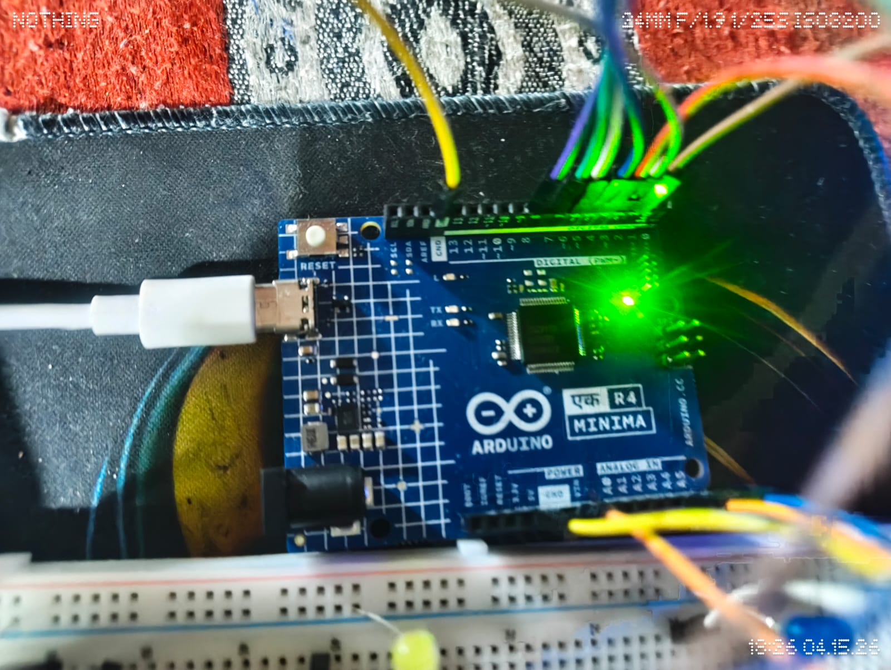
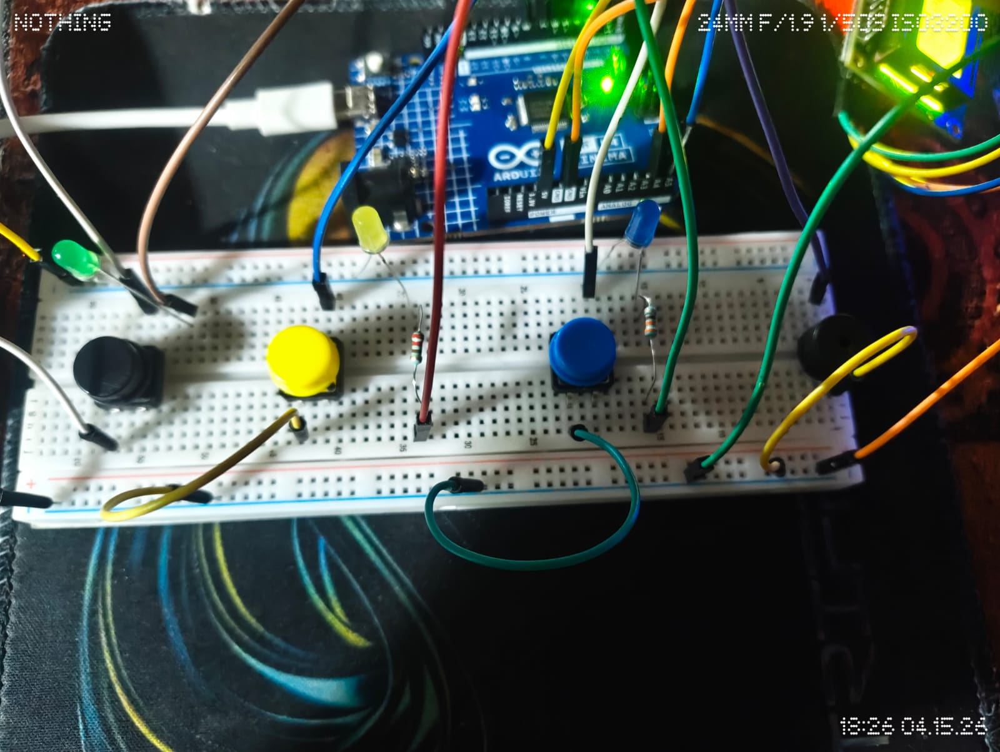
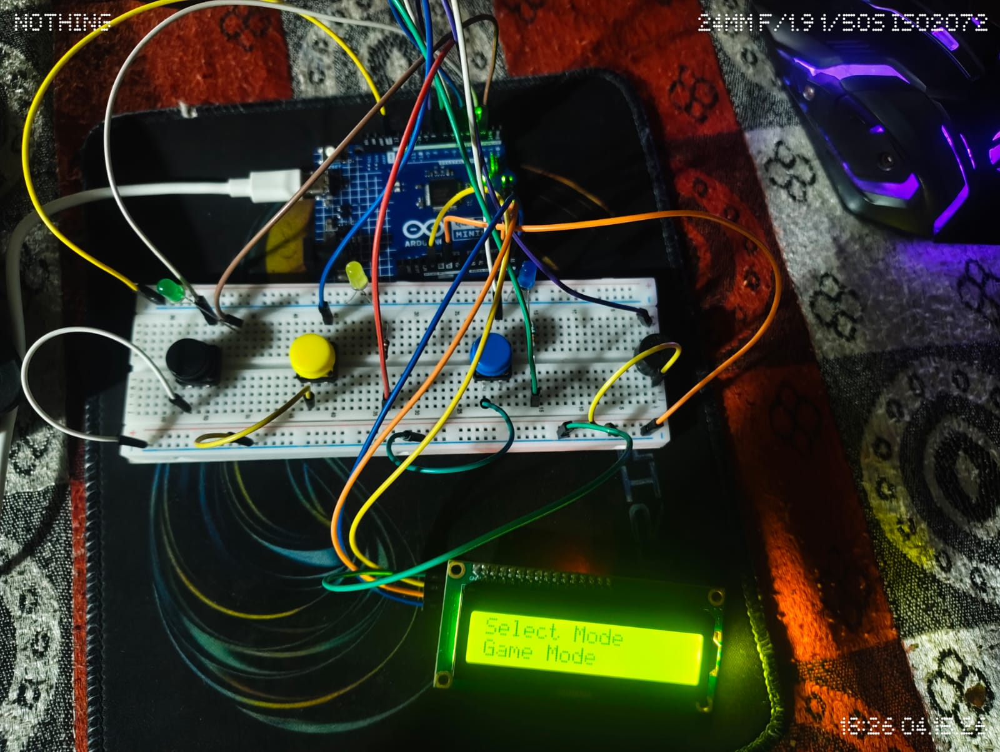
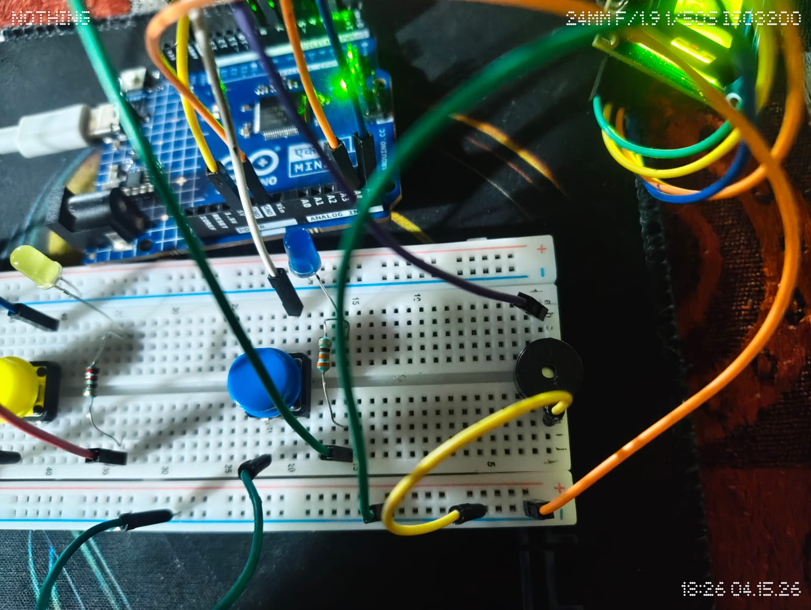
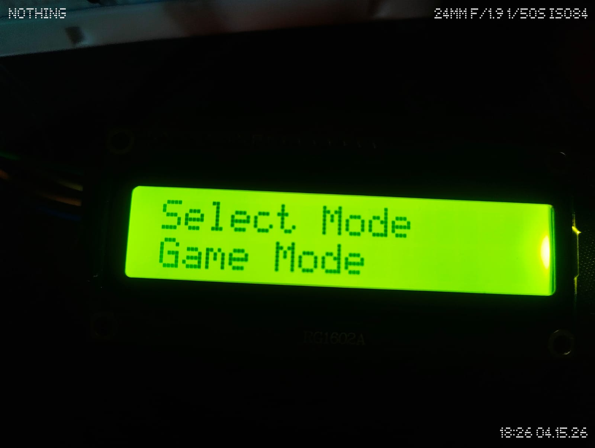

# 🎵 EchoPlay – Arduino Multi-Mode Music & Memory System



EchoPlay is a fun and interactive Arduino-based project that combines **music playback, memory challenges, and a game mode** into a single system using an LCD display, buttons, LEDs, and a buzzer.

Built as an exploration project, it started simple (just LEDs)… and quickly evolved into a complete interactive system.

---

## 🚀 Features

### 🎮 Game Mode (Simon Game)

* Increasing difficulty with random sequences
* Tests memory and reaction speed

### 🧠 Memory Mode

* Watch a sequence → repeat it correctly
* LED + sound based interaction

### 🎵 Song Mode

* Plays recognizable melodies using a buzzer
* Includes:

  * Twinkle Twinkle
  * Coffin Dance
  * Rickroll

### 📟 LCD Menu System

* Navigate between modes using buttons
* Clean and responsive UI

---

## 🛠️ Components Used

* Arduino UNO
* 16x2 I2C LCD Display
* Buzzer
* LEDs (3x)
* Push Buttons (3x)
* Resistors
* Breadboard & Jumper Wires

---

## 🔌 Circuit & Setup







---

## 📟 Menu Interface



---

## ▶️ How to Run

1. Open `Echo_Play_code.ino` in Arduino IDE
2. Connect components as shown above
3. Select the correct board and port
4. Upload the code to Arduino
5. Use buttons to navigate and play

---

## 🎮 Controls

| Button   | Function               |
| -------- | ---------------------- |
| Button 1 | Scroll through options |
| Button 2 | Select / Confirm       |
| Button 3 | Go back / Exit         |

---

## 🎵 Customizing Songs

You can add your own songs easily:

```cpp
void playSongName() {
```

Edit:

```cpp
int melody[] = { ... };
int duration[] = { ... };
```

Then connect it in menu:

```cpp
else if (songIndex == X) playYourSong();
```

👉 Keep melodies simple for best buzzer output.

---

## 📹 Demo

[Watch Demo](./Demo1.mp4)

---

## 💡 Tips

* Always use resistors with LEDs
* Use debounce delays for stable button input
* Adjust LCD contrast using the potentiometer
* Keep timing balanced for smooth experience

---

## 📌 Project Idea

This project was built while exploring Arduino through hands-on experimentation.
It demonstrates how simple components can be combined into a fully interactive system.

---

## 🧠 Future Improvements

* Add more songs
* Improve UI animations
* Add Bluetooth / wireless control
* Build a proper enclosure

---

## ⭐ If you like this project

Give it a star ⭐ and try building your own version!
